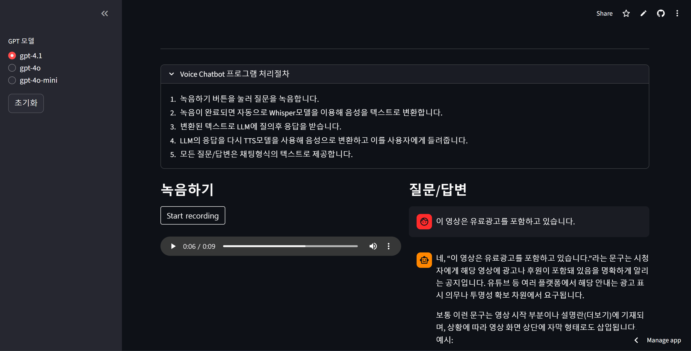

# 🎤 Voice Chatbot

OpenAI의 Whisper, GPT, TTS 모델을 활용한 음성 기반 챗봇 애플리케이션입니다.

### [Voice Chatbot APP](https://voicebot-app-hqeuygvujkufbmdxaursd3.streamlit.app/) 👈 클릭

## 📋 프로젝트 소개

이 프로젝트는 사용자의 음성 질문을 받아 텍스트로 변환하고, GPT 모델을 통해 응답을 생성한 후, 다시 음성으로 변환하여 들려주는 대화형 Voice Chatbot입니다.

### 주요 기능

- **음성 녹음**: 브라우저에서 직접 음성 녹음
- **STT (Speech-to-Text)**: OpenAI Whisper 모델을 사용한 음성 → 텍스트 변환
- **AI 대화**: GPT-4o, GPT-4o-mini 등 다양한 GPT 모델 선택 가능
- **TTS (Text-to-Speech)**: OpenAI TTS 모델을 사용한 텍스트 → 음성 변환
- **채팅 기록**: 질문과 답변을 채팅 형식으로 표시
- **대화 초기화**: 대화 내용 초기화 기능

## 🚀 실행 방법

### 1. 로컬 실행

#### 사전 요구사항
- Python 3.11+
- [OpenAI API Key](https://platform.openai.com/docs/overview)
- FFmpeg (오디오 처리용)

#### 설치 및 실행

```bash
# 저장소 클론
git clone https://github.com/MinJeung-Kim/Voicebot-App.git
cd Voicebot-App

# 가상환경 생성 및 활성화(bash)
python -m venv .venv
source .venv/bin/activate   

# 패키지 설치
pip install -r requirements.txt

# 환경 변수 설정
# .env 파일 생성 후 OpenAI API Key 추가
echo "OPENAI_API_KEY=your_api_key_here" > .env

# 앱 실행
streamlit run app.py
```

### 2. Streamlit Cloud 배포

1. GitHub 저장소에 코드 푸시
2. [Streamlit Cloud](https://streamlit.io/cloud)에서 앱 생성
3. Secrets에 OpenAI API Key 추가:
   ```toml
   OPENAI_API_KEY = "your_api_key_here"
   ```

## 📁 프로젝트 구조

```
voicebot_app/
│
├── app.py                  # Streamlit 메인 애플리케이션
├── openai_service.py       # OpenAI API 서비스 (STT, GPT, TTS)
├── requirements.txt        # Python 패키지 의존성
├── runtime.txt            # Python 버전 지정 (Streamlit Cloud용)
├── packages.txt           # 시스템 패키지 (ffmpeg)
├── .env                   # 환경 변수 (API Key)
└── public/                # 이미지 등 정적 파일
```

## 🛠️ 기술 스택

- **Frontend**: [Streamlit](https://streamlit.io/)
- **AI Models**: 
  - OpenAI Whisper (STT)
  - OpenAI GPT-4o / GPT-4o-mini (Chat)
  - OpenAI TTS (Text-to-Speech)
- **Audio Processing**: 
  - streamlit-audiorecorder
  - pydub
  - audioop-lts

## 📖 사용 방법

1. **모델 선택**: 사이드바에서 사용할 GPT 모델을 선택합니다 (기본: gpt-4o-mini)
2. **녹음하기**: 녹음 버튼을 클릭하여 질문을 녹음합니다
3. **자동 처리**: 
   - 녹음이 완료되면 자동으로 음성이 텍스트로 변환됩니다
   - GPT 모델이 응답을 생성합니다
   - 응답이 음성으로 변환되어 자동 재생됩니다
4. **기록 확인**: 오른쪽 패널에서 질문/답변 기록을 확인할 수 있습니다
5. **초기화**: 사이드바의 "초기화" 버튼으로 대화를 새로 시작할 수 있습니다

## 🔧 주요 처리 흐름

```
사용자 음성 입력
    ↓
STT (Whisper) → 텍스트 변환
    ↓
GPT 모델 → 응답 생성
    ↓
TTS → 음성 변환
    ↓
음성 자동 재생 + 채팅 기록 표시
```

## ⚙️ 환경 변수

`.env` 파일에 다음 환경 변수를 설정해야 합니다:

```env
OPENAI_API_KEY=your_openai_api_key_here
```
 
## 📺 실행 화면

 
## 🐛 문제 해결

### Python 3.13 호환성 문제
- `audioop` 모듈이 Python 3.13에서 제거되어 `audioop-lts` 패키지를 사용합니다
- `runtime.txt`에서 Python 3.11.9를 사용하도록 설정되어 있습니다

### FFmpeg 관련 에러
- Streamlit Cloud: `packages.txt`에 ffmpeg가 명시되어 있습니다
- 로컬: 시스템에 FFmpeg를 별도로 설치해야 할 수 있습니다
  - Windows: `choco install ffmpeg` 또는 [공식 사이트](https://ffmpeg.org/)에서 다운로드
  - macOS: `brew install ffmpeg`
  - Linux: `sudo apt-get install ffmpeg`
 
